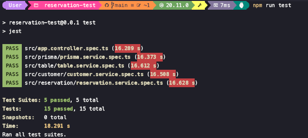

# Reservation System API Documentation

## 1. Tech Stack
The application uses the following technologies:
- **Node.js (20.11.0)** with **Nest.Js** for backend development.
- **PostgreSQL (v17)** as the database.
- **Postman** for API testing.
- **Jest** for testing.

---

## 2. Installation & How to Run

### Prerequisites
- Ensure you have **Node.js** and **npm** installed on your system.
- Install **PostgreSQL** and set up a database.

### Steps
1. Clone the repository:
   ```bash
   git clone https://github.com/rdhhauzan/reservation-test.git
   cd reservation-test
   ```

2. Install dependencies:
   ```bash
   npm install
   ```

3. Configure the environment:
   - Create a `.env` file in the root directory.
   - Add the following variables:
     ```
     DATABASE_URL="<your-database-url>"
     EMAIL_HOST="<smtp-host>"
     EMAIL_PORT="<smtp-port>"
     EMAIL_USERNAME="<smtp-username>"
     EMAIL_PASSWORD="<smtp-password>"
     ```
4. Migrate Database:
    - Create a reservation-test database
      ```sql
      CREATE DATABASE "reservation-test";
      ```
    - Migrate table
      ```sql
      -- CreateTable
      CREATE TABLE "Customer" (
          "id" SERIAL NOT NULL,
          "name" TEXT NOT NULL,
          "email" TEXT NOT NULL,
          "phone" TEXT NOT NULL,
          "createdAt" TIMESTAMP(3) NOT NULL DEFAULT CURRENT_TIMESTAMP,
          "updatedAt" TIMESTAMP(3) NOT NULL,

          CONSTRAINT "Customer_pkey" PRIMARY KEY ("id")
      );

      -- CreateTable
      CREATE TABLE "Table" (
          "id" SERIAL NOT NULL,
          "tableNumber" TEXT NOT NULL,
          "capacity" INTEGER NOT NULL,
          "isAvailable" BOOLEAN NOT NULL DEFAULT true,
          "createdAt" TIMESTAMP(3) NOT NULL DEFAULT CURRENT_TIMESTAMP,
          "updatedAt" TIMESTAMP(3) NOT NULL,

          CONSTRAINT "Table_pkey" PRIMARY KEY ("id")
      );

      -- CreateTable
      CREATE TABLE "Reservation" (
          "id" SERIAL NOT NULL,
          "customerId" INTEGER NOT NULL,
          "tableId" INTEGER NOT NULL,
          "startTime" TIMESTAMP(3) NOT NULL,
          "endTime" TIMESTAMP(3) NOT NULL,
          "createdAt" TIMESTAMP(3) NOT NULL DEFAULT CURRENT_TIMESTAMP,
          "updatedAt" TIMESTAMP(3) NOT NULL,

          CONSTRAINT "Reservation_pkey" PRIMARY KEY ("id")
      );

      -- CreateIndex
      CREATE UNIQUE INDEX "Customer_email_key" ON "Customer"("email");

      -- CreateIndex
      CREATE UNIQUE INDEX "Table_tableNumber_key" ON "Table"("tableNumber");

      -- CreateIndex
      CREATE INDEX "reservation_time_slot" ON "Reservation"("tableId", "startTime", "endTime");

      -- AddForeignKey
      ALTER TABLE "Reservation" ADD CONSTRAINT "Reservation_customerId_fkey" FOREIGN KEY ("customerId") REFERENCES "Customer"("id") ON DELETE CASCADE ON UPDATE CASCADE;

      -- AddForeignKey
      ALTER TABLE "Reservation" ADD CONSTRAINT "Reservation_tableId_fkey" FOREIGN KEY ("tableId") REFERENCES "Table"("id") ON DELETE CASCADE ON UPDATE CASCADE;
      ```
4. Sync Database with Prisma:

   ```bash
   npx prisma generate
   ```

5. Start the server:
   ```bash
   npm run start
   ```

6. To run tests:
   ```bash
   npm run test
   ```

---

## 3. Deployment Link
The live application can be accessed at: [**Deployment Link**](https://your-deployment-url.com)

---

## 4. Screenshot Running `npm run test`
Below is a screenshot of running tests successfully:


---

## 5. API Routes

| **Route**                 | **Method** | **Description**                   | **Request Body**                                                                              |
|---------------------------|------------|-----------------------------------|------------------------------------------------------------------------------------------------------------------|
| `/customer`               | POST       | Add a new customer.              | `name`, `email`, `phone`                                                             |
| `/customer`               | GET        | Get all customers.               | -                                                                                                                |
| `/customer/:id`           | GET        | Get a customer by ID.            | -                                                                                                                |
| `/customer/:id`           | PATCH      | Update a customer by ID.         | `name`, `email`, `phone`                                                             |
| `/customer/:id`           | DELETE     | Delete a customer by ID.         | -                                                                                                                |
| `/table`                  | POST       | Add a new table.                 | `tableNumber`, `capacity`, `isAvailable`                                         |
| `/table`                  | GET        | Get all tables.                  | -                                                                                                                |
| `/table/:id`              | GET        | Get a table by ID.               | -                                                                                                                |
| `/table/:id`              | PATCH      | Update a table by ID.            | `tableNumber`, `capacity`, `isAvailable`                                           |
| `/table/:id`              | DELETE     | Delete a table by ID.            | -                                                                                                                |
| `/reservation`            | POST       | Create a new reservation.        | `customerId`, `tableId`, `startTime`, `endTime`                                      |

---
